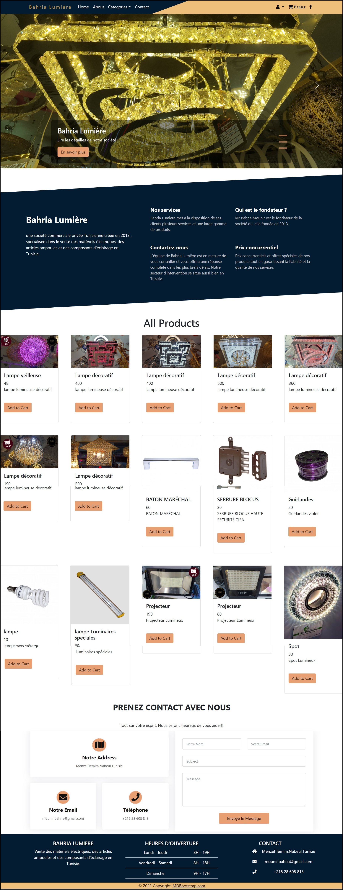
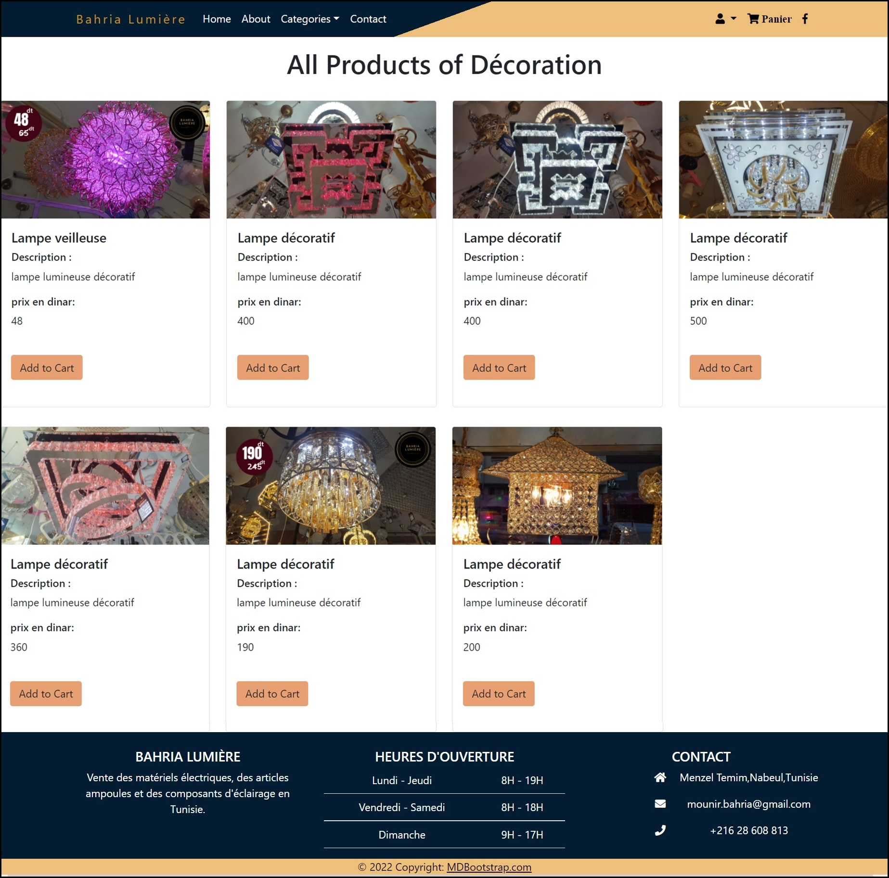
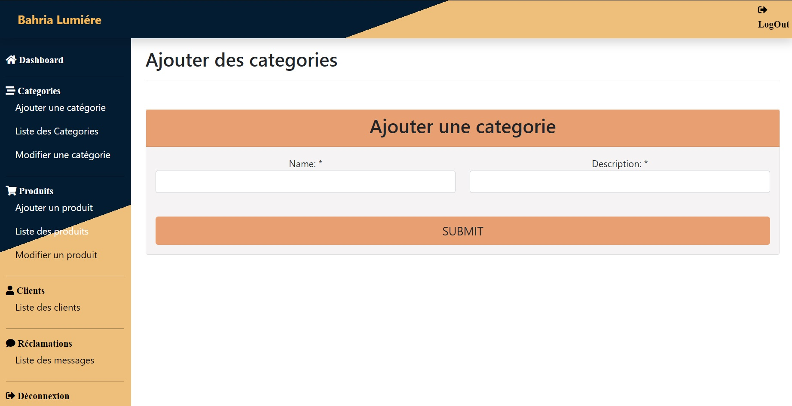
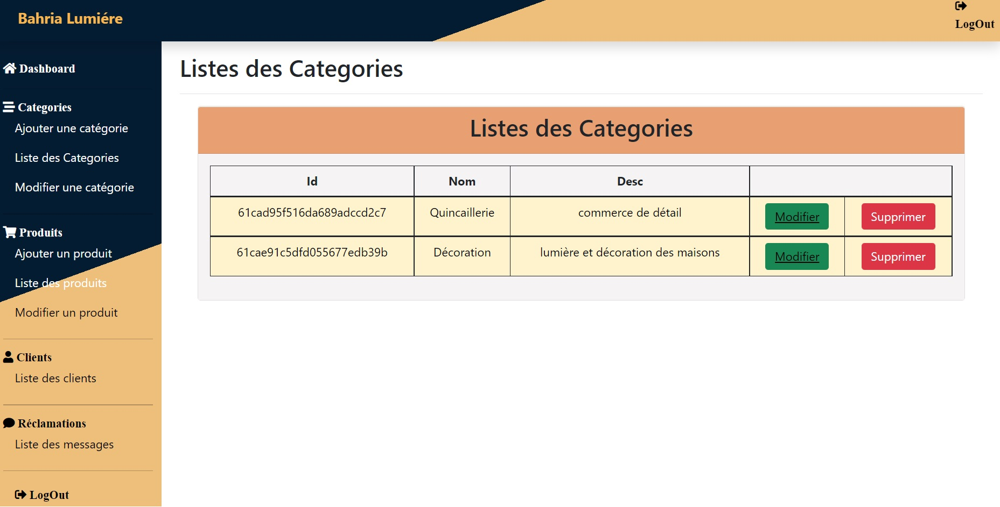
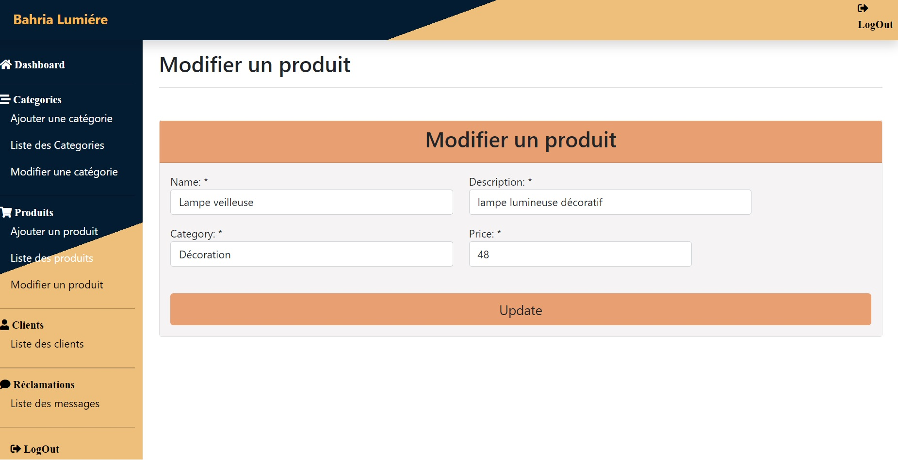
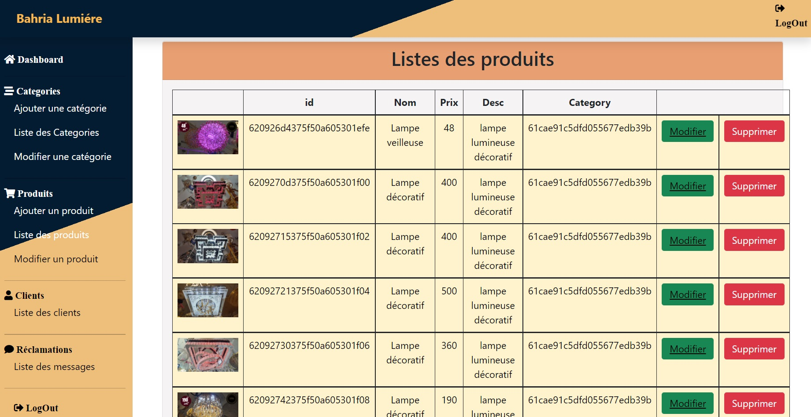
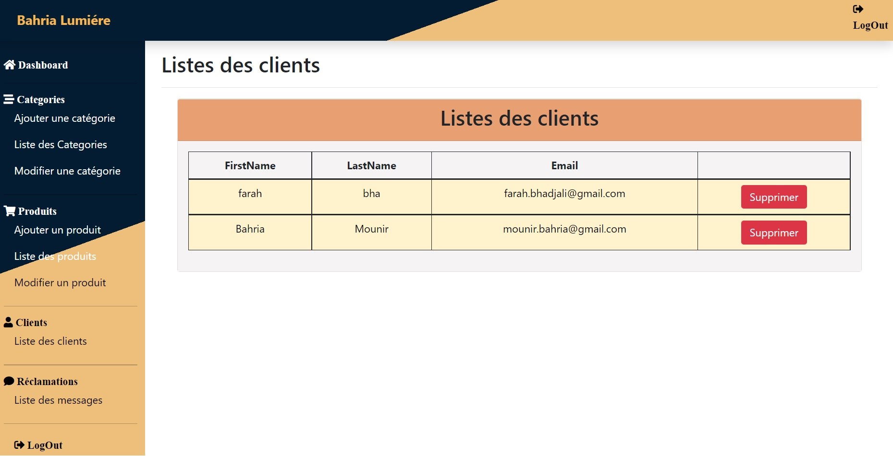
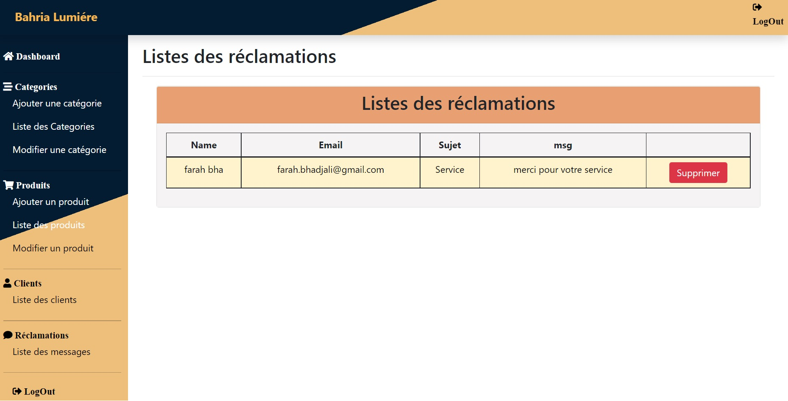

<div align="center">


</div>

<div align="center">


[](https://github.com/farah-benhadjali/bahria-lumiere-mean)

</div>

---

## 📖 Description

**Bahria Lumière** est une plateforme e-commerce fullstack développée en **MEAN Stack** (MongoDB, Express.js, Angular, Node.js), conçue pour simplifier l'achat et la vente de produits et services en ligne. Elle propose une expérience utilisateur complète avec catalogue de produits, gestion du panier, authentification sécurisée par **token JWT**, et un back-office d'administration complet.

---

## ✨ Fonctionnalités

### 👤 Espace Utilisateur
| Fonctionnalité | Composant Angular |
|---|---|
| Inscription & Connexion | `login/` · `register/` |
| Navigation catalogue | `home/` · `categorie/` |
| Fiche produit détaillée | `produit/` |
| Panier d'achat | `cart/` |
| Formulaire de contact | `listcontact/` |
| Profil utilisateur | `user.service.ts` |

### 🛠️ Espace Admin
| Fonctionnalité | Composant Angular |
|---|---|
| Dashboard administration | `admin/` |
| Ajouter un produit | `addpro/` |
| Modifier un produit | `uppro/` |
| Lister les produits | `listpro/` |
| Ajouter une catégorie | `addcat/` |
| Modifier une catégorie | `upcat/` |
| Lister les catégories | `listcat/` |
| Gestion utilisateurs | `listuser/` |
| Gestion contacts | `listcontact/` |

---

## 🛠️ Stack technique

### Backend — `/`
```
Node.js + Express.js   → Serveur HTTP & API REST
MongoDB + Mongoose     → Base de données NoSQL & ODM
JWT (token)            → Authentification stateless
Multer (multer.js)     → Upload & stockage images produits
Bcrypt                 → Hachage des mots de passe
CORS                   → Sécurité cross-origin
Dotenv (config.js)     → Variables d'environnement
```

### Frontend — `ecommerce-front/`
```
Angular                → Framework SPA
TypeScript             → Langage typé
Angular Router         → Navigation client-side
HttpClient             → Appels API REST
RxJS                   → Programmation réactive
Angular Forms          → Formulaires réactifs
```

### Base de données
```
MongoDB                → Collections : users, produits,
                         categories, carts, contacts
```

---

## 🗂️ Architecture du projet

```
bahria-lumiere-mean/
│
├── 📁 controllers/
│   └── cartController.js          → Logique métier panier
│
├── 📁 model/
│   ├── user.js                    → Schéma utilisateur + rôle
│   ├── produit.js                 → Schéma produit (nom, prix, image, stock)
│   ├── categorie.js               → Schéma catégorie
│   ├── cart.js                    → Schéma panier
│   └── contact.js                 → Schéma message contact
│
├── 📁 routes/
│   ├── auth.js                    → Inscription, connexion, token
│   ├── produit.js                 → CRUD produits
│   ├── categorie.js               → CRUD catégories
│   ├── cartRoute.js               → Gestion panier
│   ├── contact.js                 → Formulaire contact
│   └── user.js                    → Gestion utilisateurs
│
├── 📁 repository/
│   └── cartRepository.js          → Logique métier panier (pattern Repository)
│
├── 📁 uploads/                    → Images produits uploadées
│
├── config.js                      → Configuration générale & variables
├── database.js                    → Connexion MongoDB
├── multer.js                      → Configuration upload images
├── index.js                       → Point d'entrée Express
│
└── 📁 ecommerce-front/            → Application Angular
    └── src/app/
        ├── components/
        │   ├── home/              → Page d'accueil
        │   ├── produit/           → Fiche produit
        │   ├── categorie/         → Navigation par catégorie
        │   ├── cart/              → Panier d'achat
        │   ├── admin/             → Dashboard admin
        │   ├── addpro/            → Ajout produit
        │   ├── uppro/             → Modification produit
        │   ├── listpro/           → Liste produits (admin)
        │   ├── addcat/            → Ajout catégorie
        │   ├── upcat/             → Modification catégorie
        │   ├── listcat/           → Liste catégories (admin)
        │   ├── listuser/          → Gestion utilisateurs (admin)
        │   ├── listcontact/       → Gestion contacts (admin)
        │   ├── login/             → Connexion
        │   └── register/          → Inscription
        │
        ├── models/
        │   ├── produit.ts         → Interface produit
        │   ├── category.ts        → Interface catégorie
        │   ├── user.ts            → Interface utilisateur
        │   └── contact.ts         → Interface contact
        │
        ├── services/
        │   ├── auth.service.ts    → Authentification & token JWT
        │   ├── produit.service.ts → Appels API produits
        │   ├── categorie.service.ts → Appels API catégories
        │   ├── user.service.ts    → Appels API utilisateurs
        │   └── contact.service.ts → Appels API contact
        │
        └── app-routing.module.ts  → Définition des routes Angular
```

---

## 📡 API Endpoints

### 🔐 Auth — `/api/auth`
| Méthode | Route | Description | Auth |
|---|---|---|---|
| `POST` | `/register` | Inscription | ❌ |
| `POST` | `/login` | Connexion → token JWT | ❌ |

### 👥 Utilisateurs — `/api/user`
| Méthode | Route | Description | Auth |
|---|---|---|---|
| `GET` | `/` | Liste tous les utilisateurs | 🔒 Admin |
| `GET` | `/:id` | Détail utilisateur | ✅ |
| `PUT` | `/:id` | Modifier utilisateur | ✅ |
| `DELETE` | `/:id` | Supprimer utilisateur | 🔒 Admin |

### 📦 Produits — `/api/produit`
| Méthode | Route | Description | Auth |
|---|---|---|---|
| `GET` | `/` | Tous les produits | ❌ |
| `GET` | `/:id` | Détail produit | ❌ |
| `POST` | `/` | Ajouter produit + image | 🔒 Admin |
| `PUT` | `/:id` | Modifier produit | 🔒 Admin |
| `DELETE` | `/:id` | Supprimer produit | 🔒 Admin |

### 🗂️ Catégories — `/api/categorie`
| Méthode | Route | Description | Auth |
|---|---|---|---|
| `GET` | `/` | Toutes les catégories | ❌ |
| `POST` | `/` | Créer catégorie | 🔒 Admin |
| `PUT` | `/:id` | Modifier catégorie | 🔒 Admin |
| `DELETE` | `/:id` | Supprimer catégorie | 🔒 Admin |

### 🛒 Panier — `/api/cart`
| Méthode | Route | Description | Auth |
|---|---|---|---|
| `GET` | `/` | Panier utilisateur connecté | ✅ |
| `POST` | `/add` | Ajouter article | ✅ |
| `PUT` | `/update/:id` | Modifier quantité | ✅ |
| `DELETE` | `/remove/:id` | Supprimer article | ✅ |

### 📬 Contact — `/api/contact`
| Méthode | Route | Description | Auth |
|---|---|---|---|
| `POST` | `/` | Envoyer message | ❌ |
| `GET` | `/` | Lire messages | 🔒 Admin |

> ✅ Token JWT requis &nbsp;|&nbsp; 🔒 Admin = token + rôle admin &nbsp;|&nbsp; ❌ Public

---

## 🚀 Installation

### Prérequis
- Node.js v16+
- MongoDB local ou [Atlas](https://cloud.mongodb.com)
- Angular CLI : `npm install -g @angular/cli`

### Backend

```bash
# Cloner le repo
git clone https://github.com/farah-benhadjali/bahria-lumiere-mean.git
cd bahria-lumiere-mean

# Installer les dépendances
npm install

# Configurer l'environnement
# → Modifier config.js avec tes valeurs

# Lancer le serveur
node index.js
# ou
npx nodemon index.js
```

> Serveur disponible sur **http://localhost:3000**

### Frontend

```bash
cd ecommerce-front

# Installer les dépendances
npm install

# Lancer l'application Angular
ng serve
```

> Application disponible sur **http://localhost:4200**

---

## ⚙️ Configuration — `config.js`

```js
module.exports = {
  DB_URI    : "mongodb://localhost:27017/bahria_lumiere",
  JWT_SECRET: "votre_secret_jwt",
  PORT      : 3000,
  UPLOAD_DIR: "uploads/"
}
```

---

## 🔐 Rôles & Accès

| Rôle | Accès |
|---|---|
| **Visiteur** | Catalogue, catégories, fiche produit, contact |
| **Utilisateur** | + Panier, profil |
| **Admin** | + Dashboard, CRUD produits & catégories, gestion users & contacts |

---

## 📸 Captures d'écran

<table align="center">

  <!-- Pages utilisateur -->
  <tr>
    <td align="center"><b>Accueil</b></td>
    <td align="center"><b>Catalogue</b></td>
  </tr>
  <tr>
    <td align="center"></td>
    <td align="center"></td>
  </tr>

  <!-- Dashboard Admin -->
  <tr>
    <td colspan="2" align="center"><br/><b>Dashboard Admin</b></td>
  </tr>
  <tr>
    <td colspan="2" align="center">
      <table>
        <tr>
          <td></td>
          <td></td>
          <td></td>
        </tr>
        <tr>
          <td></td>
          <td></td>
          <td></td>
        </tr>
      </table>
    </td>
  </tr>

</table>

---


## 📄 Licence

Ce projet est sous licence **MIT** — voir le fichier [LICENSE](LICENSE).

---

<div align="center">


Développé avec ✨ par [Farah Benhadjali](https://github.com/farah-benhadjali)

*Plateforme E-Commerce · MEAN Stack · Bahria Lumière 2021*

</div>
